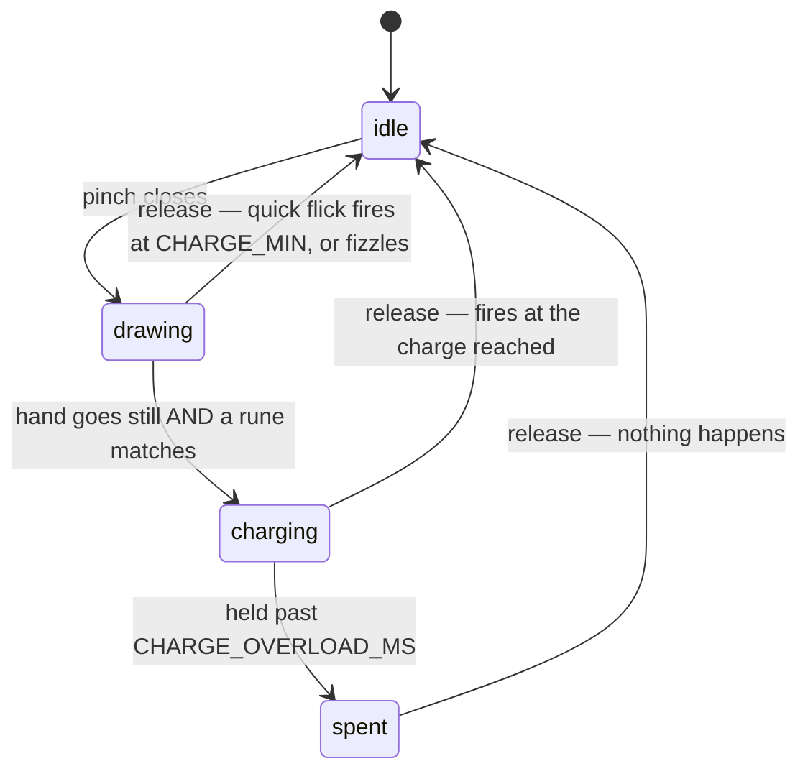

# How the recogniser works

`js/spell-room/magic.js` decides whether a wave of the hand becomes a spell.
It is the only file in the project with no dependencies on Three.js, the DOM,
or the camera — it takes normalised 0..1 points and returns verdicts, which is
why all 43 tests can run without anyone standing in front of a webcam.

This note is about *why* it is shaped the way it is. The code says what it
does; most of the decisions below were paid for with a bug.

## The pipeline

```
camera frame
  │
  ├─ isPinching()      is the hand pinched?          ← self-calibrating gate
  │
  ├─ updateStroke()    record the fingertip path     ← while the gate is open
  │
  ├─ resample()        64 evenly spaced points       ← kills drawing speed
  ├─ normalizeStroke() centre at 0, scale to unit    ← kills position and size
  ├─ scoreAgainst()    best over every orientation   ← kills direction, start point
  │
  ├─ floor + margin    is the best score good enough, and clearly best?
  │
  └─ updateCast()      idle → drawing → charging → fire
```

Each stage removes one thing the player should not have to control. What
survives all of them is the shape itself, which is the only thing a rune is.

## 1. The gate calibrates itself

The naive pinch test is one line — thumb-to-index distance under some
threshold — and it is wrong twice.

**Scale.** A distance in screen space shrinks as you step back from the lens,
so a fixed threshold silently becomes "make a fist" at arm's length. The gate
divides by hand size (wrist → middle knuckle) and compares the ratio.

**Everything else.** Even as a ratio, the right number depends on the camera,
the distance metric, and the shape of the player's hand. It was tuned once as
an absolute and then broke: switching the metric from 2D to 3D compressed every
ratio by roughly half, which made the old 0.65 release threshold *unreachable*.
The gate could close and never open again — every cast overloaded, and nothing
on screen said why.

So `PINCH_ON` 0.35 and `PINCH_OFF` 0.55 are not ratios. They are **fractions of
the range observed this session**: 0 is the tightest pinch seen so far, 1 the
widest opening. The gate learns your hand from your hand.

Two consequences worth knowing:

- **It needs to see the range before it works.** Until the observed spread
  exceeds `PINCH_MIN_RANGE` (0.08), the readout says `OPEN + CLOSE TO
  CALIBRATE` and pinching does nothing. This is the single most common "the
  game is broken" report, and it is why the message exists.
- **The extremes creep back in** by 0.06% per frame. Without that, one freak
  reading at an extreme would stretch the range for the rest of the session and
  drag every threshold with it.

On top of the range, two standard defences against landmark jitter:
**hysteresis** (it takes less to stay pinched than to start — the gap between
`PINCH_ON` and `PINCH_OFF` is a dead zone the noise lives inside) and
**debounce** (`PINCH_HOLD_MS` 60 — a disagreement has to persist before it
counts). Hysteresis alone still flips on a single loud frame.

The test for the gate is behavioural, not numerical: hold a pinch dead still
for ten seconds and count transitions. You want zero. Then pinch deliberately
ten times. You want ten.

## 2. Resampling is the load-bearing step

A hand drawing slowly produces a dense clump of points; the same shape drawn
fast produces a sparse one. Comparing those point-by-point is meaningless.
After `resample(points, 64)`, point *i* means "*i*/64 of the way along the
path" regardless of speed, and every comparison downstream becomes valid.

The bug everyone writes first: after emitting an interpolated point, continuing
to measure from the *segment end* rather than from the new point. Long segments
then swallow points they should have produced. The second one: not carrying the
accumulator across segments, which makes the output depend on how finely the
input happened to be sampled — segments shorter than one step contribute
nothing, so a densely traced stroke loses most of its length and all the points
bunch at the end.

Its test is exact, not statistical: a straight line from (0,0) to (1,0) with
n=5 must give x = 0, 0.25, 0.5, 0.75, 1. Nothing else is close enough.

## 3. One scale, both axes

`normalizeStroke` translates the bounding-box centre to the origin and divides
by the **larger** of width and height — deliberately not by each axis
separately. Per-axis scaling stretches every shape to fill a square, so a wide
arc and a tall arc become the same drawing and start matching each other's
templates.

## 4. Orientation search: what counts as "the same rune"

`scoreAgainst` scores a candidate against every orientation that should still
count, and keeps the best:

- **Reversal, always.** A rune traced right-to-left is the same rune, and
  roughly half of all players are left-handed.
- **Rotation, for closed shapes only.** Point-by-point comparison assumes both
  strokes begin in the same place. A circle has no corner to start from; a
  five-pointed star has five equally natural ones. Without cyclic rotation,
  four out of five correct drawings of a star score near zero and are rejected
  — and nothing on screen could tell the player that the top point was the
  special one. All three current runes are `closed: true`.

You need both. Reversal handles direction, rotation handles the starting point.

The score itself is `clamp(1 - distance / 0.38)`. That 0.38 is the "how wrong
is too wrong" constant; tune it by drawing *badly* on purpose, not by drawing
well.

## 5. Two numbers, two different jobs

This is the part most worth understanding, because conflating them is how
gesture interfaces go bad.

| | | |
|---|---|---|
| `SCORE_FLOOR` | 0.60 | keeps nonsense out |
| `SCORE_MARGIN` | 0.05 | keeps two runes from trading places |

**The floor** lives in the measured gap between correct strokes and scribbles.
At ±8% jitter a correct rune scores 0.47 at worst and 0.64 at the 10th
percentile; random scribbles top out at 0.49 and sit at 0.00 median. 0.60 lands
inside that gap. Raising it does not buy safety that is not already there —
0.72 threw away a third of people who had drawn correctly.

**The margin** requires the best rune to beat the runner-up by 0.05. Without
it, a drawing sitting between two runes casts a different spell on different
attempts, which reads as the game being broken rather than as the player having
drawn badly.

**Never lower the floor to fix a low recognition rate.** It is the reflex, and
it trades a false reject for a false accept — the wrong direction, for a reason
worth stating plainly:

- **False reject** — you drew it right, nothing happened. Annoying, and
  recoverable if it is rare and if the fizzle looks different from "no hand
  detected".
- **False accept** — you drew Ringfall and got Aegis. Worse, and not symmetric
  with the above. It reads as the game being broken, and retrying does not
  repair the impression.

If the wrong spell fires, raise the **margin**. If recognition is poor, change
the **shape**.

## 6. Where the runes actually sit

Measured, not guessed. Run it yourself after touching any rune:

```bash
npm run runes
```

```
              ringfall    aegis       gravity-seal
ringfall      —           0.175       0.463
aegis         0.175       —           0.467
gravity-seal  0.463       0.467       —
```

| distance | verdict |
|---|---|
| > 0.35 | comfortable — a shaky hand will not cross the gap |
| 0.15 – 0.35 | workable; the jitter test tells you what it costs |
| < 0.15 | the same gesture under two names |

**The closest pair is Ringfall and Aegis, at 0.175** — a circle against an
upright triangle. This is counter-intuitive and worth internalising: the
obvious guess is that Aegis and Gravity Seal are the risky pair, since they are
the same triangle inverted. They are not. They are the *furthest* apart of the
three, at 0.467, because a point-down triangle is not a cyclic rotation of a
point-up one — reversal and rotation cannot turn one into the other, so the
search never brings them close.

The circle is the promiscuous shape. Being rotationally symmetric, the rotation
search can align it against nearly anything, which drags it toward every other
rune at once. **A fourth rune is most likely to collide with Ringfall, not with
whichever shape it superficially resembles.** Measure; do not reason from the
picture.

One historical number, because it is exactly the trap that bit the earlier
build: an arc `⌒` and an inverted V `∧` sit **0.057** apart. To point-by-point
comparison they are the same shape, so a slightly rounded `∧` casts the arc's
spell at high confidence — wrong spell, no fizzle, no warning. Corner count
separates shapes far better than curvature does.

## 7. The cast state machine

The shape decides *which* spell. How long you keep pinching after the shape
finishes decides *how hard*.



The non-obvious parts:

**Going still ends the stroke, not letting go.** Releasing the pinch is "fire",
so the drawing has to end some other way. `STILL_SPEED` 0.22 and `STILL_MS` 360
are deliberately slow and long: corners are where a hand naturally slows, so a
trigger-happy pair locks a half-drawn shape at the first vertex. That failure
lands precisely on the strokes that were going *well*, and every rune now has
corners, which makes it worse rather than better.

**A failed lock says nothing.** If the hand goes still and no rune matches, the
stroke keeps recording. The player may simply be pausing mid-rune, and yanking
the stroke away from them there would be the most infuriating possible failure.

**`spent` exists so overload is felt.** After overloading, the machine waits
for the release instead of starting a fresh stroke immediately. Without it the
punishment costs the player nothing they can perceive — and a punishment nobody
notices is not tension, it is a bug that feels like bad luck.

**Overload is 5000ms, not 2200ms.** The tighter value fired before the player
had finished looking at their own charge ring. A ceiling that lands while you
are still learning the mechanic is a wall, not a risk. It is what stops "always
charge to full" from being the only strategy, so it should be tightened
eventually — but only once the spell is worth rushing for.

**`bestMatch` vs `recognize`.** `bestMatch` is measurement without policy: the
closest rune and how close, whatever the floor and margin would say. `recognize`
is that plus the two rules. The live preview uses the raw version, because
"Ringfall, 45%, not yet" is the one thing a player mid-stroke actually needs,
and it is precisely the answer `recognize` throws away.

## Adding a rune

In this order. The order is the point — you cannot judge whether two shapes are
distinguishable until you have the thing that distinguishes them.

1. Add it to `RUNES` in `magic.js`: control points in a 0..1 box, in the order
   a hand would draw them, and `closed: true` if the stroke returns to its
   start.
2. `npm run runes`. If anything is under 0.15, stop and change the shape. Watch
   the Ringfall column especially.
3. `npm test`. The jitter suite draws each rune 200 times at ±8% and requires
   ≥90% recognition, and separately asserts that the *wrong* spell never fires.
4. Wire it up in `js/arena.js` — a cast function, a cooldown entry, a cost in
   `js/arena/config.js`.

If step 3 fails, go back to step 1. Do not adjust `SCORE_FLOOR`.

## Reading the numbers live

Both pages put the gate's internals on the glass — `pinchDebug()` returns the
current ratio, the two computed thresholds, the observed low and high, and
whether calibration has happened yet. Diagnosing a gate you cannot see is
guesswork; one number on screen turns it into tuning. `practice.html` does the
same for the bow, which is the whole reason that page exists.
